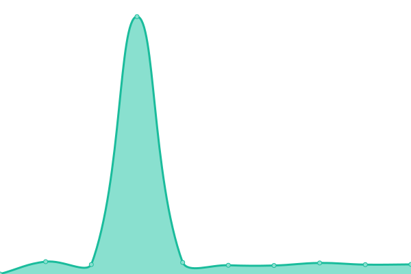

# [📈 Live Status](https://status.groupechaumeil.fr): <!--live status--> **🟥 Complete outage**

This repository contains the open-source uptime monitor and status page for [Upptime](https://upptime.js.org), powered by [Upptime](https://github.com/upptime/upptime).

With [Upptime](https://upptime.js.org), you can get your own unlimited and free uptime monitor and status page, powered entirely by a GitHub repository. We use [Issues](https://github.com/upptime/upptime/issues) as incident reports, [Actions](https://github.com/ChaumeilDigital/upptime/actions) as uptime monitors, and [Pages](https://status.groupechaumeil.fr) for the status page.

<!--start: status pages-->
<!-- This summary is generated by Upptime (https://github.com/upptime/upptime) -->
<!-- Do not edit this manually, your changes will be overwritten -->
<!-- prettier-ignore -->
| URL | Status | History | Response Time | Uptime |
| --- | ------ | ------- | ------------- | ------ |
|  PPC1 | 🟥 Down | [ppc-1.yml](https://github.com/ChaumeilDigital/upptime/commits/HEAD/history/ppc-1.yml) | 

 3044ms
     
 | 

<a href="https://status.groupechaumeil.fr/history/ppc-1">99.98%</a>
    

|  PPC2 | 🟥 Down | [ppc-2.yml](https://github.com/ChaumeilDigital/upptime/commits/HEAD/history/ppc-2.yml) | 

 1299ms
     
 | 

<a href="https://status.groupechaumeil.fr/history/ppc-2">99.99%</a>
    

|  WebDoc | 🟥 Down | [web-doc.yml](https://github.com/ChaumeilDigital/upptime/commits/HEAD/history/web-doc.yml) | 

 918ms
     
 | 

<a href="https://status.groupechaumeil.fr/history/web-doc">99.99%</a>
    

|  [Site Groupe](https://groupechaumeil.fr/) | 🟥 Down | [site-groupe.yml](https://github.com/ChaumeilDigital/upptime/commits/HEAD/history/site-groupe.yml) | 

 1572ms
     
 | 

<a href="https://status.groupechaumeil.fr/history/site-groupe">100.00%</a>
    

<!--end: status pages-->

[**Visit our status website →**](https://status.groupechaumeil.fr)

## 📄 License

- Powered by: [Upptime](https://github.com/upptime/upptime)
- Code: [MIT](./LICENSE) © [Upptime](https://upptime.js.org)
- Data in the `./history` directory: [Open Database License](https://opendatacommons.org/licenses/odbl/1-0/)
